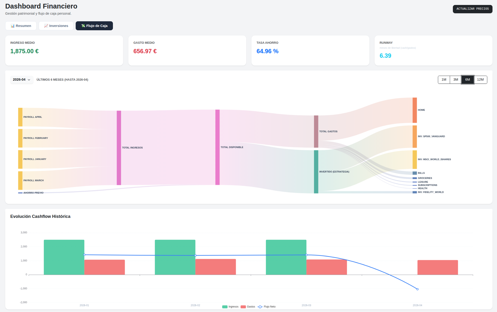
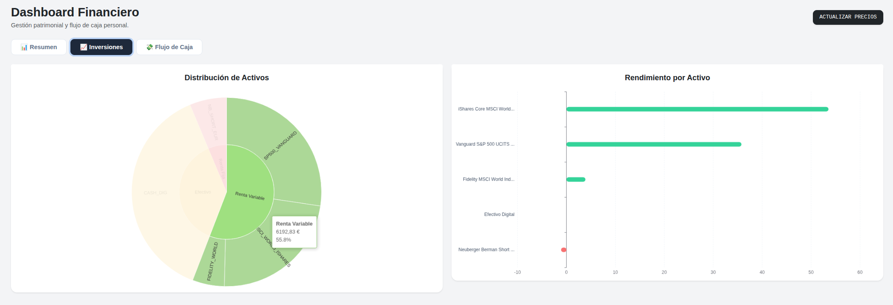
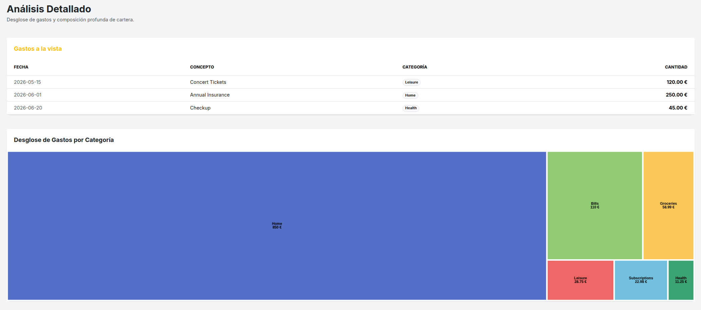

# 💰 Gestión de Patrimonio Personal
> **Ecosistema Financiero Privado, Local e Inteligente.**

[](https://www.python.org/)
[](https://flask.palletsprojects.com/)

Un motor financiero de nivel profesional para el seguimiento del patrimonio neto, el ahorro y las inversiones. Toda la lógica se ejecuta localmente; tus datos nunca abandonan tu infraestructura.

---

## 🖼️ Funcionalidades Destacadas

### 📊 Seguimiento Holístico del Patrimonio


Aprovecha modelos predictivos para calcular tu patrimonio futuro, runaway entre otros.

### 📈 Distribución de Activos de Precisión


Visualiza tu exposición al riesgo, rendimiento a nivel de activo individual y el ROI en tiempo real.

### 💸 Inteligencia de Flujo de Caja y Ahorro


Categoriza tus gastos y adelantate a los que vienen.

*Nota: Los datos mostrados en las capturas son artificiales.*

---

## 🚀 Despliegue

```bash
git clone https://github.com/Rubenpombo/personal-finance.git
cd personal-finance

python3 -m venv .venv
source .venv/bin/activate
pip install -r requirements.txt

./run.sh
```
> **Punto de acceso predeterminado:** `http://localhost:8501`

---

## 📐 Arquitectura de Datos
Inicializa tu espacio de trabajo copiando los archivos de `/data_template` en una nueva carpeta `/data`.

<details>
<summary><b>📂 Configuración de Cartera (activos.csv, aportaciones.csv)</b></summary>

### `activos.csv` (Catálogo de Activos)
| Columna | Descripción | Valores Soportados / Ejemplo |
| :--- | :--- | :--- |
| `id` | Identificador único (Clave Primaria). | `SP500_VANGUARD` |
| `nombre` | Nombre legible por humanos. | `Vanguard S&P 500 UCITS ETF` |
| `isin` | ISIN del activo o 'CASH'. | `IE00B3XXRP09`, `CASH` |
| `tipo` | Clase de activo para la lógica de asignación. | `Renta Variable`, `Renta Fija`, `Efectivo`, `Materias Primas` |
| `fuente` | Fuente de valoración. | `quefondos` (Scraping automático), `manual` |
| `precio_actual`| Último precio conocido (usado si es manual). | `115.42` |

### `aportaciones.csv` (Transacciones)
| Columna | Descripción | Ejemplo |
| :--- | :--- | :--- |
| `fecha` | Fecha de la operación (YYYY-MM-DD). | `2026-02-15` |
| `tipo` | Naturaleza de la transacción. | `COMPRA`, `VENTA`, `INICIAL`, `AJUSTE_VALOR` |
| `id_activo` | ID del activo objetivo (del catálogo). | `MSCI_WORLD` |
| `cantidad_dinero` | Importe bruto movido. | `1000.00` |
| `titulos` | Número de unidades/participaciones. | `10.5` |
| `precio_titulo` | Precio de ejecución por unidad. | `95.23` |
| `notas` | Metadatos opcionales. | `Plan de ahorro mensual` |
</details>

<details>
<summary><b>📂 Seguimiento de Flujo de Caja (ingresos.csv, gastos_variables.csv, gastos_recurrentes.csv)</b></summary>

### `ingresos.csv` (Registro de Ingresos)
| Columna | Descripción | Ejemplo |
| :--- | :--- | : :--- |
| `fecha` | Fecha de recepción. | `2026-01-30` |
| `cantidad` | Importe neto. | `2500.00` |
| `concepto` | Descripción. | `Nómina` |
| `categoria` | Agrupación. | `Salario` |

### `gastos_variables.csv` (Gastos Variables)
| Columna | Descripción | Ejemplo |
| :--- | :--- | :--- |
| `fecha` | Fecha del gasto. | `2026-02-05` |
| `cantidad` | Importe. | `55.20` |
| `categoria` | Etiqueta de visualización. | `Alimentación` |
| `concepto` | Detalle. | `Supermercado` |

### `gastos_recurrentes.csv` (Compromisos Mensuales Fijos)
| Columna | Descripción | Ejemplo |
| :--- | :--- | :--- |
| `dia` | Día del mes (1-31). | `5` |
| `cantidad` | Importe mensual fijo. | `12.99` |
| `categoria` | Etiqueta de proyección. | `Suscripciones` |
| `concepto` | Nombre. | `Netflix` |
</details>

---

## 📂 Artefactos del Sistema
*   `data/cartera.csv`: Estado calculado actual (Instantánea).
*   `data/latest_prices.json`: Valoraciones de mercado en caché.
*   `data/precios_historicos.csv`: Datos históricos de precios.

---

## 🛠 Stack Tecnológico
- **Motor:** Python 3.12 / Pandas
- **Interfaz:** Flask / Bootstrap 5
- **Visualización:** ECharts.js
- **Automatización:** Scrapers locales

---
Desarrollado por [Rubenpombo](https://github.com/Rubenpombo)
